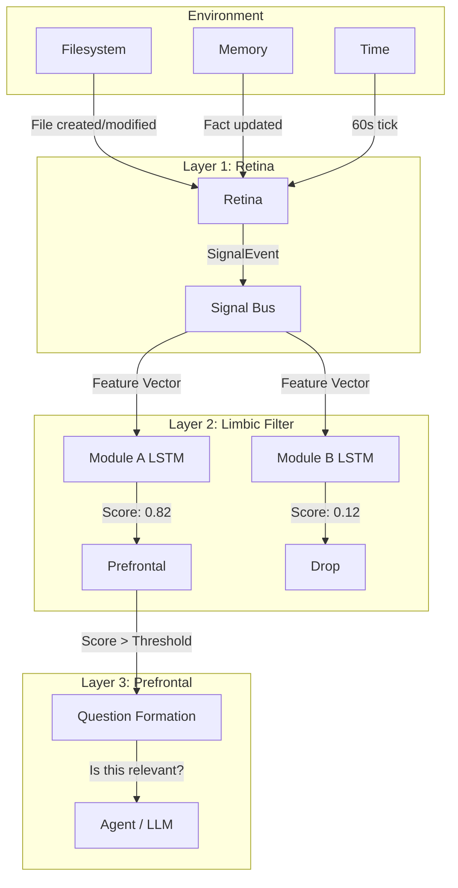

The Pulse is designed to solve the "when to wake up" problem for AI agents without relying on expensive LLM polling or rigid cron jobs. It does this by passing environmental signals through three increasingly abstract layers.

## The Signal Flow

### 1. The Retina (Raw Signal Detection)

The Retina is the "1s and 0s" layer. It runs continuously, costs almost nothing, and knows nothing about meaning. Its only job is to detect **change**.

When a file is created, a memory fact is updated, or a minute passes, the Retina captures it and normalises it into a `SignalEvent`. This event contains a fixed-length numeric feature vector (e.g., file size, extension hash, time of day encoded as sine/cosine).

### 2. The Limbic Filter (Relevance Scoring)

The Limbic layer contains a registry of tiny, independent neural networks (LSTMs) — one for each registered module. 

When a `SignalEvent` arrives on the bus, every module's LSTM scores it. These models are tiny (under 100k parameters) and run in milliseconds on a CPU. They do not understand language; they only recognize patterns in the feature vectors. If a module's score exceeds its threshold, the signal moves up.

### 3. The Prefrontal Layer (Question Formation)

When a signal scores high enough, the Prefrontal layer takes over. It uses the module's predefined `question_template` to form a specific question, substituting variables like `{location}` with the actual path or namespace that triggered the signal.

If question formation succeeds, the Pulse fires an `EscalationDecision`. This is the first time language is generated, and it is the point where the AI agent is finally woken up.

## The Design Philosophy

> **AI is used only where no deterministic process can do the job. Everything else is infrastructure.**

An LLM classifying emails that could be classified by regex is not just expensive — it is the wrong tool. The Pulse ensures that the LLM is only invoked when there is genuine ambiguity that requires reasoning, creativity, or judgment.
